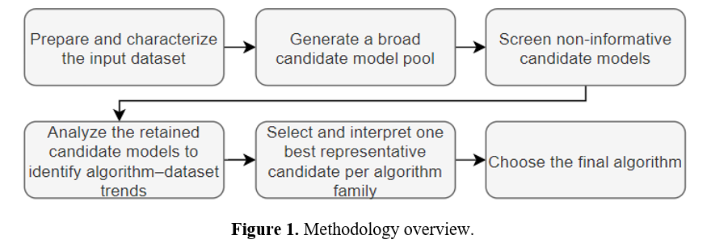

# Trajectory Clustering Comparison Methodology

Reference implementation accompanying the peer-reviewed article:

**N. Vincent-Boulay and C. Marsden, "A comparative evaluation methodology of unsupervised clustering algorithms for ADS-B trajectory-based aircraft behavior analysis," _Computing and Artificial Intelligence_, vol. 4, no. 2, article 4416, 2026.**  
DOI: https://doi.org/10.59400/cai4416

## Overview

This repository isolates the clustering-comparison methodology used to evaluate multiple unsupervised learning approaches on equal-length aircraft trajectory representations. The research workflow compares:

- K-means;
- DBSCAN;
- HDBSCAN;
- Gaussian mixture models (GMM).

Candidate solutions are evaluated with standard internal clustering metrics together with algorithm-specific diagnostics such as noise fraction for density-based methods.

The original study used a representative five-hour LaGuardia-area ADS-B dataset containing 343 processed aircraft trajectories. That research dataset is not redistributed here. A deterministic synthetic dataset and test suite are included so the methodology can be exercised without the original data.

<p align="center">
  
</p>

<p align="center"><em>Figure 1. Methodology overview. Reproduced from Vincent-Boulay and Marsden (2026), <a href="https://doi.org/10.59400/cai4416">A comparative evaluation methodology of unsupervised clustering algorithms for ADS-B trajectory-based aircraft behavior analysis</a>, licensed under <a href="https://creativecommons.org/licenses/by/4.0/">CC BY 4.0</a>.</em></p>

## What this repository demonstrates

- interpolation of multivariate aircraft trajectories to the paper's 64-point common sequence length;
- construction of model-ready vectors from X/Y/Z sequences plus trajectory duration and original point count;
- standardized preprocessing for distance-based clustering;
- K-means, DBSCAN, HDBSCAN, and GMM candidate fitting;
- silhouette, Davies-Bouldin, and Calinski-Harabasz evaluation;
- explicit treatment of density-clustering noise points;
- comparable candidate summaries across algorithms;
- a self-contained synthetic demonstration and regression tests.

## Repository structure

```text
.
├── README.md
├── CITATION.cff
├── requirements.txt
├── .gitignore
├── src/
│   └── trajectory_clustering/
│       ├── __init__.py
│       ├── preprocessing.py
│       ├── models.py
│       └── evaluation.py
├── examples/
│   └── run_synthetic_demo.py
├── tests/
│   ├── test_preprocessing.py
│   └── test_models.py
└── docs/
    ├── 2.png
    ├── REPRODUCIBILITY.md
    └── RESEARCH_CODE_PROVENANCE.md
```

## Quick start

Install the direct dependencies:

```bash
pip install -e ".[dev]"
```

Run the synthetic comparison:

```bash
python -m examples.run_synthetic_demo
```

Run the tests:

```bash
pytest -q
```

## Relationship to the research code

This repository is a **reference implementation** of the comparison methodology presented in the associated paper. This research subsequently evolved as part of a larger PhD airspace modeling project. This code preserves the core algorithm families, trajectory representation, evaluation metrics, and treatment of noise while removing unrelated thesis orchestration and aircraft-categorization interpretation code.

The earlier public repository `aircraft-behaviour-categorization-model` corresponds to a different published study focused on aircraft categorization using clustering. This repository is intentionally narrower: its purpose is the **comparative clustering methodology** itself.

## Data

The original ADS-B study dataset and generated candidate-result artifacts are not redistributed here. See `docs/REPRODUCIBILITY.md` for the expected trajectory table format and the distinction between the synthetic demo and full study reproduction.

## Scope and limitations

Internal clustering metrics quantify properties of a candidate partition; they do not by themselves establish that clusters correspond to operationally meaningful aircraft categories. Interpretation and domain validation remain separate steps.

## Citation

If this repository or methodology is useful in your work, please cite:

```text
N. Vincent-Boulay and C. Marsden,
"A comparative evaluation methodology of unsupervised clustering algorithms
for ADS-B trajectory-based aircraft behavior analysis,"
Computing and Artificial Intelligence, vol. 4, no. 2, article 4416, 2026.
https://doi.org/10.59400/cai4416
```

A machine-readable citation is provided in `CITATION.cff`.

## Author

**Nicolas Vincent-Boulay**  
Aerospace engineering PhD candidate and machine-learning researcher
